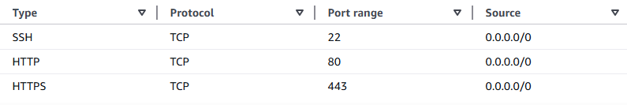

# Creating a Virtual Server in AWS

## Pre-requisites
Assuming a Linux environment is pre-installed and running on a Virtual box with:
- An AWS account (root or IAM user with EC2 permissions)
- A valid payment method or free tier plan
- Windows: PowerShell or Terminal
- Mac/Linux: Terminal

## 1. Log in to the AWS EC2 Management Console 
- Go to: http://aws.amazon.com/ec2/
- Sign in to Console.
- Search for **EC2** in the search bar and open it.

## 2. Select Region
At the top-right of the AWS Console:
Choose a region close to you or your users
- For example, **ap-southeast-2 (Sydney)** for Australia

This is important because latency depends on region and resources are region-specific.

## 3. Launch an EC2 Instance
**Click** the orange button that says **Launch Instance**.

3.1 Under **Name and tags**, give the instance a meaningful name so it can be identified later.
- For example, MyCloudServer.

3.2 Under **Application and OS Images (Amazon Machine Image)**:
Select **Ubuntu** and choose **Ubuntu Server 24.04 LTS** from the drop-down menu.

3.3 Choose an instance type by selecting **t3.micro**.

3.4 Click **Create new key pair**, and give it a meaningful name like **webserver-key**.
Then, choose **RSA** and **.pem**, and click on **Create key pair**. 
To verify your identity, AWS uses key files instead of username and password.
This is an important step as the file **cannot** be downloaded again. 
Therefore, do **NOT** lose this file.

3.5 Click on **Edit** to configure the **Network settings** and leave it as default.
For the **Firewall**, select **Create security group** and call it **ssh-and-web**. 
**Inbound Security Group Rules** should be set like the following table: \
 \
SSH is used for loggin in remotely, HTTP is for web server, and HTTPS is for secure web traffic.

3.6 **Configure storage** to **8 GB gp3**. 

3.7 Once these configurations are done, click **Launch Instance** and **View all instances**. 

## 4. Connect EC2 to the Virtual Machine via SSH
- Select the instance you have created and click on **Connect**.
- Choose **SSH client** tab. 
- Open Powershell, Linux Terminal line or the MacOS terminal on your device. Then use 'cd' to move to the directory where you downloaded your key and paste this. 
``` bash
chmod 400 "yourkeyname.pem"
ssh -i "yourkeyname.pem" ubuntu@your_ec2_public_dns_or_IP
```

Then, type **yes** to have SSH access to your cloud machine. 

## 5. Install Nginx
Once you have the Terminal line access to your virtual machine, you need to update the apt repositories:
``` bash
sudo apt update
```

Then, you can install the **Nginx Web Server** using:
``` bash
sudo apt install nginx-full
```

## 6. Test the Webserver in Browser
To test your webserver, let's first create an **index.html** on the **Terminal line** and modify the HTML file.
``` bash
nano /var/www/html/index.html
```

``` bash
<!DOCTYPE html>
<html lang="en">
<head>
    <meta charset="UTF-8">
    <title>My First Webpage</title>
</head>
<body>
    <h1>Welcome to My Website</h1>
    <p>This is a paragraph of text inside an HTML file.</p>
</body>
</html>
```
To find your public IP address, go to **EC2 Dashboard** -> **Instance** -> **Public IPv4**.
Open a browser and paste the IP address with **http://** before the IP address and click enter to ensure your web page is working. 
