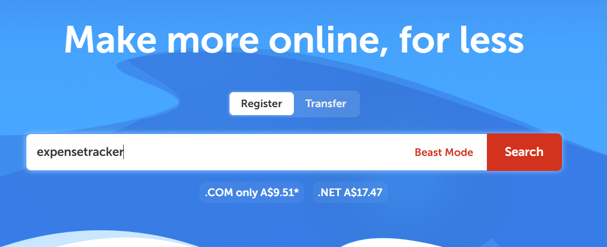
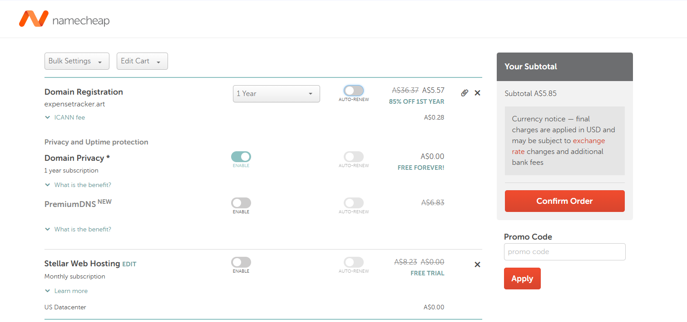
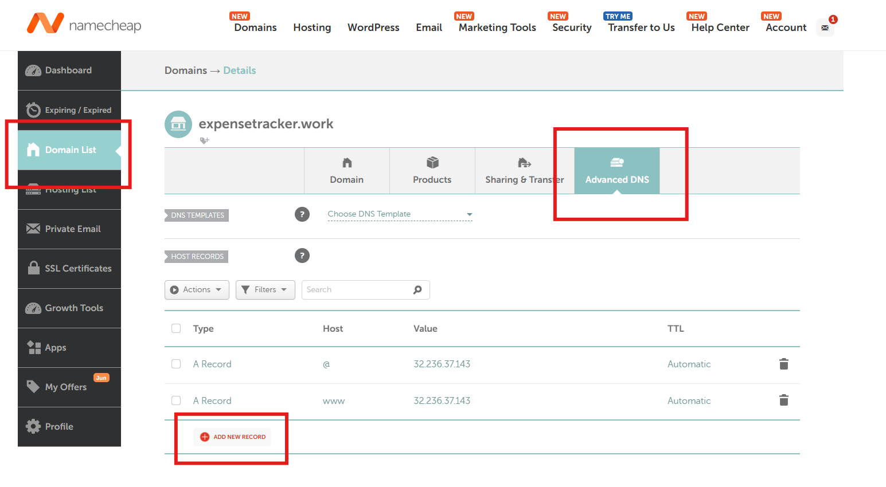
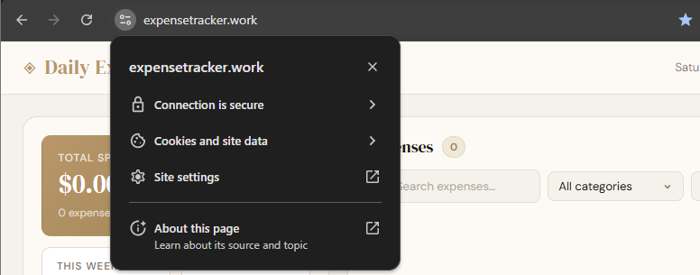
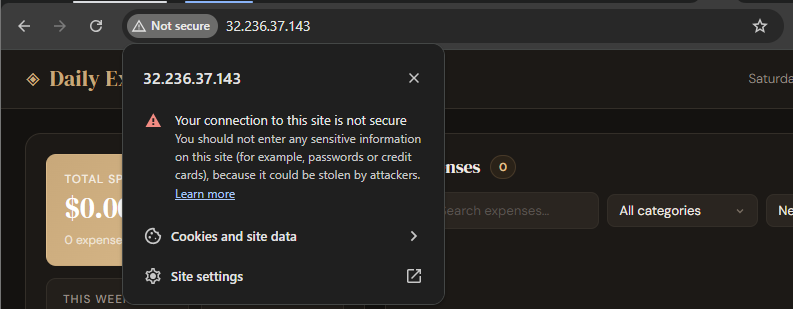

# Part 1. Uploading Project Files to EC2

## Pre-requisites
- EC2 Public IP address
- EC2 key file
- Ubuntu username

## 1. Upload full Project folder to your local VM terminal
- On your Virtual Machine, open the Terminal.
- Set the directory to where the key file is. 
For example:
``` bash
cd /home/user/Downloads
```

- To upload the Project folder, use this command:
```bash
scp -i mykey.pem -r ProjectFolder ubuntu@EC2_PUBLIC_IP:/home/ubuntu/
```
For example,
``` bash
scp -i webserverkey.pem -r Test ubuntu@3.27.6.95:/home/ubuntu/
```

## 2. Move files into web directory on EC2
- First, you need to use SSH to enter EC2.
``` bash
ssh -i mykey.pem ubuntu@EC2_PUBLIC_IP
```
For example,
``` bash
ssh -i webserverkey.pem ubuntu@3.27.6.95
```
- Then, move the files:
``` bash
sudo mv ProjectFolder/* /var/www/html/
```
For example,
``` bash
sudo mv Test/* /var/www/html/
```

## 3. Test the website
Open the website by entering the public IP address into a browser.
``` bash
http://EC2_PUBLIC_IP
```
For example,
``` bash
http://3.27.6.95/
```

# Part 2. Setting up DNS
## 1. Go to https://www.namecheap.com/ and search for a domain name to give your website.

 

Select a domain name you would like to purchase and add it to your cart.

 

Once you have purchased your domain name, go to **Domain List** on the left of the website.
Then, click on **Advanced DNS** and *Add new record** to add **A Records** to directly link your public IP Address to your domain name.
Please choose the correct type and enter the host and public IP address.

 

## 2. Test DNS
Once you have linked your IP address to your domain, let's test it by opening a browser and entering the domain you purchased.
For example,
``` bash
http://yourdomain.com
```
Note: Ensure it is **http://** before the domain name as we haven't setup SSL/TLS.
If it works, you will be able to access your server using the domain name instead of the IP address

# Part 3. Setting up SSL/TLS (HTTPS)
## Pre-requisites
- Running on VM Terminal
- TCP port 22, 80, and 443 are open and available through the firewall.

## 1. Switch from local VM terminal to EC2
You should be able to ssh from your local VM to EC2 before getting a HTTPS certificate.
``` bash
ssh -i pemkey.pem yourusername@yourdomain-name-goes-here.com
```

## 2. Obtaining a digital certificate from Let's Encrypt
``` bash
https://certbot.eff.org/
```
## 3. Install Nginx on your cloud machine
``` bash
sudo apt update
sudo apt install nginx -y
```

## 4. Install Certbot
``` bash
sudo apt install snapd -y
sudo snap install core
sudo snap refresh core
sudo snap install --classic certbot
sudo ln -s /snap/bin/certbot /usr/local/bin/certbot
```

## 5. Run SSL setup
``` bash
sudo certbot --nginx -d yourdomain.com -d www.yourdomain.com
```

## 6. Verify SSL
Check if your website has **https://** encryption and has a secure lock icon with no browser warnings
``` bash
https://yourdomain.com
```

For example:
A website with secure encryption
 

A website with no secure encryption
 

